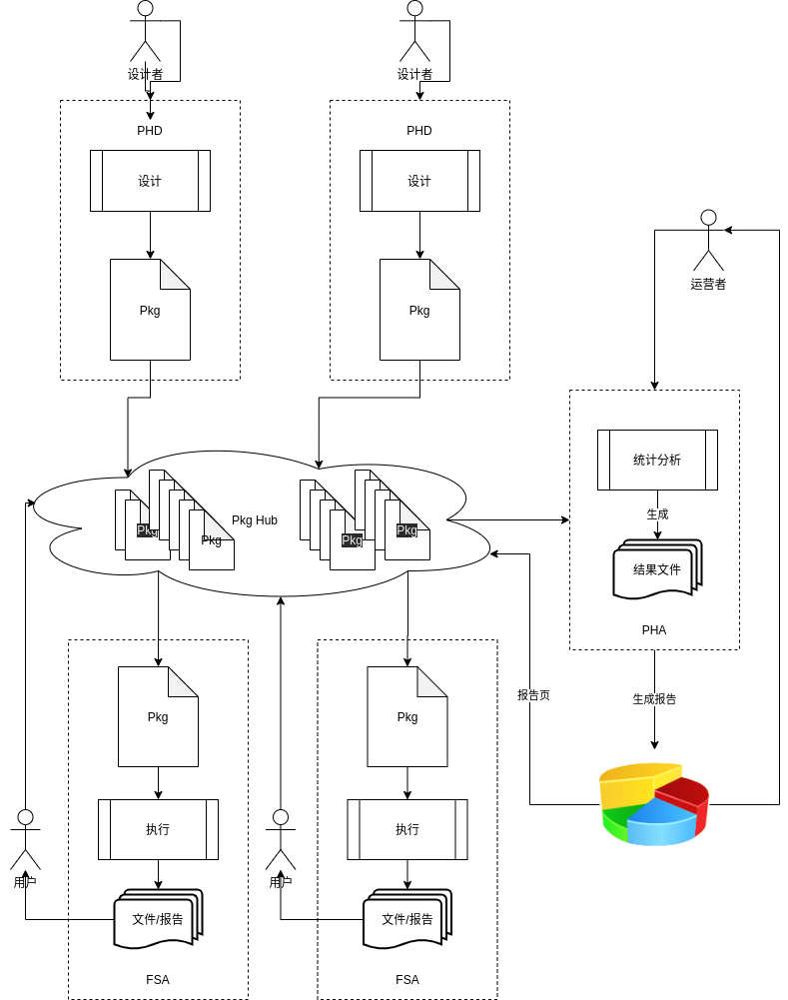

# 关于首页统计系统的设计构思

## 目录

- [预期结果](#预期结果)
- [FSAnalysis:FSA](#FSAnalysis:FSA)
- [PkgHub:PH](#PkgHub:PH)
- [PkgHubDesign:PHD](#PkgHubDesign:PHD)
- [PkgHubAnalysis:PHA](#PkgHubAnalysis:PHA)

## 预期结果

- _FS Analysis_：支持按照已有包进行检索、统计，预计检索与统计为不同的功能划分
  - Search：提供检索能力
    - Statistic：在检索的基础之上支持统计能力
      - Analysis：在统计的能力之上提供可视化分析能力
- _PkgHub Design_：支持高度复杂的包设计能力，可对包进行导出与发布
- _PkgHub_：检索、下载包
- _PkgHub Analysis_：对 PkgHub 的分析、统计

**生态图**

## FSAnalysis:FSA

FSA 的能力应该是`渐进式`的，也就是 Search 是基本功能，是每一个检索包所必须拥有的能力，是 Statistic 能力的前置能力；而 Statistic 能力又是 Analysis 能力的前置能力。i.e. 如果希望购买 Analysis 能力，那么就意味着你同时会购买 Search 与 Statstic 能力。

应用的设计应该围绕 Pkg 进行，可以把一个 Pkg 理解为一项技能，当你没有任何 Pkg 时，您就没有任何的行为能力。

一个 Pkg 应该包含具体行为的可行范围，什么意思呢？emmm···也就是说 Pkg 中应该指明它可调动的过滤参数、输出参数、能力（Search/Statistic/Analysis）。

FSA 在打开指定的 Pkg 时会读取其能力并对 FSA 的能力页面进行初始化。

## PkgHubDesign:PHD

Pkg 的设计器，支持各种能力的`设计`，感觉应该使用 `electron` 开发（目前还没有什么可靠的依据）。

## PkgHub:PH

应该类似于 Github，提供对 Pkg 的`上架管理`、`预览`、`购买`的能力。

## PkgHubAnalysis:PHA

PkgHub 的`后台分析`，可以对各种包的`下载量`进行统计分析。
