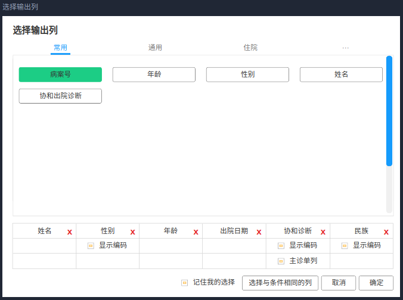

# 首页系统：检索

## 系统架构


## 开发环境

前端库使用 jquery + bootstrap 为主的方式进行开发。
业务层使用 egg.js framwork + nunjucks view engine 的组合进行接口与页面的开发渲染。
数据层使用 sqlserver + elasticsearch 两种 db，其中，elasticsearch 提供检索统计能力，sqlserver 提供非检索统计能力。
此外还用到了 redis 库，但并没有直连它，而是通过应用层服务代理完成缓存需求。

## 解决的问题

-   采用集群部署方式，极大的提高了检索性能
-   从前后端分离的方式改为服务端渲染，同时将大量的数据进行了拆解，避免了检索大批量数据时出现的客户端假死问题
-   条件栏作为工具栏停靠在右侧，选择条件更加方便快捷，有效的避免了选择两个同样的过滤项时需要打开两次面板的问题
-   引入 xm-select.js 插件解决可枚举字典的远程搜索、多选功能。
-   引入 tempusdominus-bootstrap-4.js + moment.js 的组合解决日期组件不友好的问题，支持输入诸如 2020、202010 此类

## 现存的问题

-   检索时，当约束过少时，存在页面失去响应的问题，考虑使用异步的方式进行检索，而不是让用户同步等待检索结果。
    -   考虑生成一个 search_id，在用户进行检索时把 search_id 发送给用户，后台在完成检索后，把结果存库，用户可以通过 search_id 查看检索的状态。
    -   考虑将检索之后的结果保存到本地，将 search_id 作为文件名，将检索结果完整放入其中。
    -   检索结果应该提供定期清理的机制，不能无限制的永久保存。
    -   \[可选\] 需要一个任务队列，因为当检索时如果生成一个 search_id 就返回的话，有可能导致检索根本就没有开始启动，另一方面如果每个人接到请求之后都立刻进行检索估计引擎本身可能也受不了。
    -   Need a worker process do that only get the task from seqence and run it.
    -   页面右上角添加一个消息角标，用来定期检索是否有完成的任务
-   由于一些现实原因，检索必须是同步的方式完成
    -   在进行大数据量的检索时，由于数据量级过大会导致 es 与 node 应用站点出现 memory 层面的问题，为了解决该问题，es 层面给出了 [search-after](https://www.elastic.co/guide/en/elasticsearch/reference/current/paginate-search-results.html#search-after) 方案，目前正在尝试中···
    -   search-after 不需要传递 from 字段，但是需要传递 search_after 字段，理论上该字段给的是上一页 hits 中最后一项的 sort 字段。
-   异次病发的个数需要控制，默认只允许 4 级异次，要可配

## 检索

### 关于异次病发的功能设计

> 0. 【可选】取住院次大于 1 的 mrid
> 1. 【以步骤 0 作为 filter】获取满足第一组诊断的病案号，及其 ipbid
> 2. 把第一步的 mrid 作为 filter，ipbid 作为 must_not filter，获取满足第二组诊断的病案号，及其 ipbid
> 3. 把第二步的 mrid 作为 filter，ipbid 作为 must_not filter，获取满足第三组诊断的病案号，及其 ipbid
> 4. ...
> 5. 取最后一次命中的 mrid、ipbid，以 mrid 为条件，从循环中的每一步得到的 mrid, ipbid 对中取 mrid 属于最终结果集中的 mrid 的 ipbid 拼接为一个 ipbid 数组
> 6. 【可选】如果希望支持单次住院满足，则每次的 must_not 可以跳过

## 统计

## 如何选择输出列？



目前考虑上方为列选择，每选择一个条件则下侧表格在最后添加一个列，该列支持删除、拖拽与其他列交换位置。

同时不同的列拥有不同的属性，这个属性可能是高度个性化的，无法做到很好的抽象（目前）。

说道这里我想应该考虑一个问题，是否把带有编码的列默认显示为 code + (name) 的展现形式？

emmmmm...

分步骤来考虑把，假设每个列是这个样子的

```js
{
    name: '协和诊断',
    code: 'diagnosis',
    columns: 'DiagnosisCode,DiagnosisName',
    formatter: 'time', // 如果是 time 类型的字段可能需要格式化
    fileds_type: 'r|rf|raf', // r: root; rf: root_fileds; raf: root_array_fileds;
    path: '',
    extension: {
        /**
         * 单独的主
         * 目前来看仿佛仅有诊断类型的字段会有此需求
        */
        separate_main: true,
        show_code: true,
    }
}
```

那么有了这样的字段该如何使用？

1. 首先来考虑 es 的 \_source 需要的是一个字符串数组，那么需要把传递到后端的列数组做一个转换

```js
let columns = [...]
es_source = columns.map(c => c.columns).join(',').split(',')
```

2. 检索时，默认都使用 code 检索

3. 检索完毕之后的输出

-   main column 需要单独提出来
-   拼接的列需要循环拼，不排除以后会有 > 2 个列拼凑的情况
-   已知的字段会分为 3 种类型：
    -   root 字段
    -   非 root 字段
    -   非 root 数组字段

目前总结的列字段应该有如下这些属性

```js
// 映射值
function mapping(data_row, columns) {
    let row = {}
    columns.forEach((c) => {
        row[c.code] = getValue(data_row, c)
    })
    return row
}
// 获取值
function getValue(row, col) {
    let value = ''
    col.columns.split(',').forEach((c, idx) => {
        let v = ''

        if (col.fileds_type === 'rf' || col.fileds_type === 'raf') {
            v = findValue(row, c, col.path, col.fileds_type)
        } else {
            v = row[c]
        }
        if (idx !== 0) v = `（${v}）`
        v = fmtValue(col.formatter, v)

        value += v
    })
    return value
}
// 查找值
function findValue(row, fields, path, type) {
    if (!type || !path || type === 'r') {
        return row[fields]
    }
    let path_split = path.split(',')
    return path_split.reduce((prev, cur, idx) => {
        if (idx === path_split.length - 1) {
            if (type === 'rf') {
                return prev[cur][fields]
            } else {
                return prev[cur].map((r) => r[fields]).join(', ')
            }
        } else return prev[cur]
    }, row)
}
// 格式化值
function fmtValue(fmt, value) {
    if (!fmt || !this[fmt]) return value
    else return this[fmt](value)
}
```

## 下载功能如何实现？

基于存在用户检索的结果可能会有 10w+ 数据行的可能性，在后端一口气检索出所有数据然后写文件显然是不合理的，并且这个操作非常有可能导致内存溢出或者服务端假死。那么建立在这个现状的基础之上，分批量导数是必然的要求。

考虑在有文档总量的前提下，以每页 1000 个文档数为 limit 对总文档进行页码总数进行求值运算，然后循环总页数去数据库提取数据（别忘了使用 redis 存储的 wsl）。

根据部分检索测试案例可以大致得出如下的检索耗时结果：
|page|limit|time_spend|
|:-:|:-:|:-:|
|1~100|1000|200ms~300ms|
|100~200|1000|400ms~500ms|
|200+|1000|400ms+|

那么 200 \* 1000 = 200000，我们假设真的要导出这 20w 的数据，按照平均每一次检索耗时 400ms 计算，那么 200 \* 400 = 80,000ms = 80s，老实说这是一笔不算短的时间，并且还没有计算写入磁盘文件的耗时，假设写入磁盘文件的耗时与每一笔检索耗时相同，那么总共可能需要 160s ≈ 3min。

如此长时间的等待显然是让人痛苦的，所以这里可以考虑添加一个数据导出进度定期反馈的功能，比如通过 SSE 使得在每次检索下一笔 1000 的时刻通知客户端已经完成了 1000 行数据的提取之类。

最好再支持取消：）


