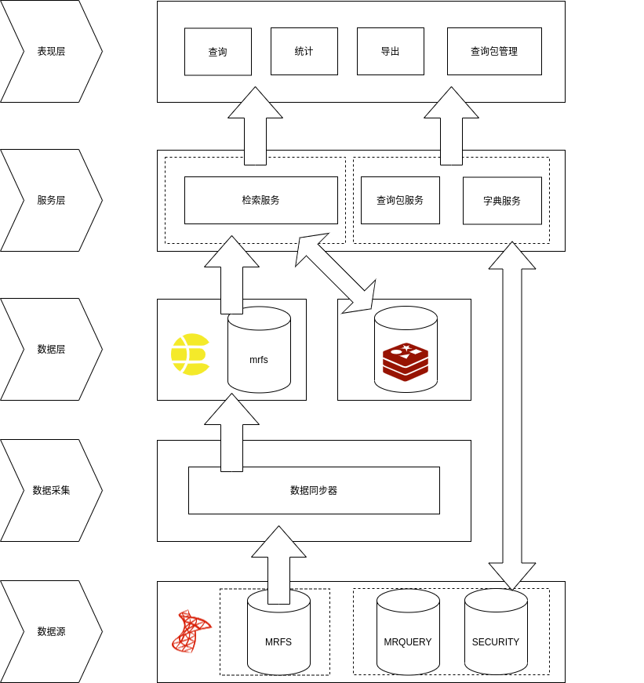

# 首页系统：检索

## 系统架构

## 开发环境

前端库使用 jquery + bootstrap 为主的方式进行开发。
业务层使用 egg.js framwork + nunjucks view engine 的组合进行接口与页面的开发渲染。
数据层使用 sqlserver + elasticsearch 两种 db，其中，elasticsearch 提供检索统计能力，sqlserver 提供非检索统计能力。

## 解决的问题

-   引入 xm-select.js 插件解决可枚举字典的远程搜索、多选功能。
-   引入 tempusdominus-bootstrap-4.js + moment.js 的组合解决日期组件不友好的问题。

## 现存的问题

-   检索时，当约束过少时，存在页面失去响应的问题，考虑使用异步的方式进行检索，而不是让用户同步等待检索结果。
    -   考虑生成一个 search_id，在用户进行检索时把 search_id 发送给用户，后台在完成检索后，把结果存库，用户可以通过 search_id 查看检索的状态。
    -   考虑将检索之后的结果保存到本地，将 search_id 作为文件名，将检索结果完整放入其中。
    -   检索结果应该提供定期清理的机制，不能无限制的永久保存。
    -   \[可选\] 需要一个任务队列，因为当检索时如果生成一个 search_id 就返回的话，有可能导致检索根本就没有开始启动，另一方面如果每个人接到请求之后都立刻进行检索估计引擎本身可能也受不了。
    -   Need a worker process do that only get the task from seqence and run it.
    -   页面右上角添加一个消息角标，用来定期检索是否有完成的任务
-   由于一些现实原因，检索必须是同步的方式完成
    -   在进行大数据量的检索时，由于数据量级过大会导致 es 与 node 应用站点出现 memory 层面的问题，为了解决该问题，es 层面给出了 [search-after](https://www.elastic.co/guide/en/elasticsearch/reference/current/paginate-search-results.html#search-after) 方案，目前正在尝试中···
    -   search-after 不需要传递 from 字段，但是需要传递 search_after 字段，理论上该字段给的是上一页 hits 中最后一项的 sort 字段。
-   异次病发的个数需要控制，默认只允许 4 级异次，要可配

## 检索

### 关于异次病发的功能设计

> 0. 【可选】取住院次大于 1 的 mrid
> 1. 【以步骤 0 作为 filter】获取满足第一组诊断的病案号，及其 ipbid
> 2. 把第一步的 mrid 作为 filter，ipbid 作为 must_not filter，获取满足第二组诊断的病案号，及其 ipbid
> 3. 把第二步的 mrid 作为 filter，ipbid 作为 must_not filter，获取满足第三组诊断的病案号，及其 ipbid
> 4. ...
> 5. 取最后一次命中的 mrid、ipbid，以 mrid 为条件，从循环中的每一步得到的 mrid, ipbid 对中取 mrid 属于最终结果集中的 mrid 的 ipbid 拼接为一个 ipbid 数组
> 6. 【可选】如果希望支持单次住院满足，则每次的 must_not 可以跳过

## 统计
